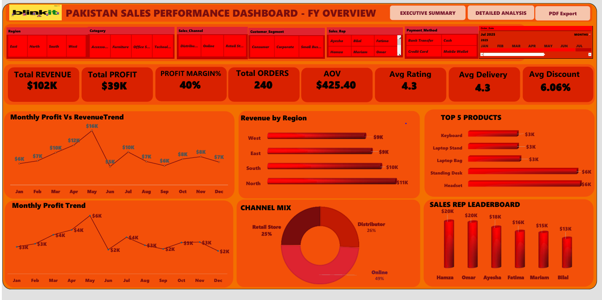
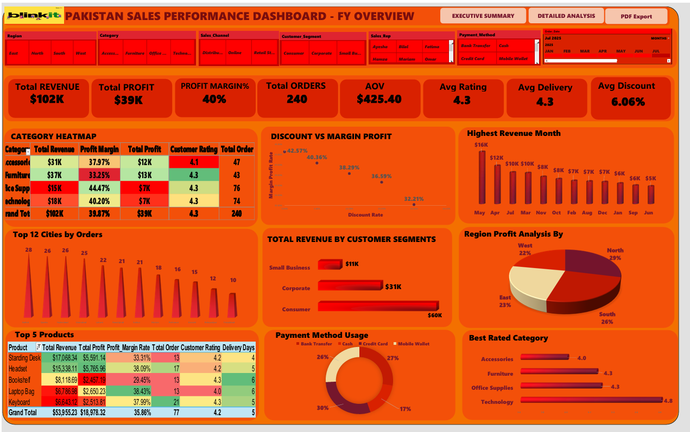

# 🇵🇰 Pakistan Sales Performance Dashboard — FY2026

---

## 📌 What Is This Project?

This is a **professional Excel Sales Dashboard** built for
Pakistan business operations in **FY2026**.

It helps business teams instantly understand:
- ✅ How much revenue and profit was generated
- ✅ Which regions, products, and reps performed best
- ✅ How sales channels and payment methods compare
- ✅ Which cities have the most orders

---

## 🔢 Key Numbers At A Glance

| 📊 Metric | 💡 Value |
|-----------|---------|
| 💰 Total Revenue | **$102K** |
| 📈 Total Profit | **$39K** |
| 📊 Profit Margin | **40%** |
| 🛒 Total Orders | **240** |
| 💵 Avg Order Value | **$425.40** |
| ⭐ Avg Customer Rating | **4.3 / 5** |
| 🚚 Avg Delivery Days | **4.3 Days** |
| 🏷️ Avg Discount | **6.06%** |

---

## 🖼️ Dashboard Preview

### 📄 Page 1 — Executive Summary

### 📄 Page 2 — Detailed Analysis

---

## 📂 Project Files

---

## 🛠️ Tools Used

| Tool | Purpose |
|------|---------|
| **Microsoft Excel** | Dashboard & data analysis |
| **Pivot Tables** | Data summarization |
| **Excel Charts** | Visual reporting |
| **Slicers & Filters** | Interactive filtering |
| **VBA Macros** | PDF export & automation |
| **PDF Export** | Final sharing format |

---

## 📊 Dashboard Features

### ✅ Page 1 — Executive Summary

#### 🎛️ Interactive Slicers (Filters)
| Filter | Options |
|--------|---------|
| 🗺️ Region | East, North, South, West |
| 📦 Category | Accessories, Furniture, Office Supplies, Technology |
| 🛒 Sales Channel | Distributor, Online, Retail Store |
| 👥 Customer Segment | Consumer, Corporate, Small Business |
| 👤 Sales Rep | Ayesha, Bilal, Fatima, Hamza, Mariam, Omar |
| 💳 Payment Method | Bank Transfer, Cash, Credit Card, Mobile Wallet |
| 📅 Order Date | January – July 2025 |

#### 📈 Charts & Visuals
- 📉 Monthly Profit vs Revenue Trend (12 months)
- 📉 Monthly Profit Trend Line
- 📊 Revenue by Region (Horizontal Bar)
- 🏆 Top 5 Products by Revenue
- 👤 Sales Rep Leaderboard
- 🍩 Sales Channel Mix (Donut Chart)

---

### ✅ Page 2 — Detailed Analysis

#### 📋 Category Performance Heatmap

| Category | Revenue | Margin | Profit | Rating | Orders |
|----------|---------|--------|--------|--------|--------|
| Accessories | $31K | 37.97% | $12K | ⭐ 4.1 | 47 |
| Furniture | $37K | 33.25% | $13K | ⭐ 4.3 | 43 |
| Office Supplies | $15K | 44.47% | $7K | ⭐ 4.3 | 76 |
| Technology | $18K | 40.20% | $7K | ⭐ 4.3 | 74 |
| **Grand Total** | **$102K** | **39.87%** | **$39K** | **4.3** | **240** |

#### 📊 More Visuals
- 🔵 Discount vs Margin Profit (Scatter Plot)
- 🏙️ Top 12 Cities by Orders (Bar Chart)
- 👥 Revenue by Customer Segment (Bar Chart)
- 📅 Highest Revenue Month Chart
- 🥧 Region Profit Analysis (Pie Chart)
- 💳 Payment Method Usage (Donut Chart)
- ⭐ Best Rated Category (Bar Chart)
- 📋 Top 5 Products Detailed Table

---

## 🏆 Key Business Insights

### 👤 Sales Rep Leaderboard
| Rank | Rep | Sales |
|------|-----|-------|
| 🥇 1 | Hamza | $20K |
| 🥈 2 | Omar | $20K |
| 🥉 3 | Ayesha | $18K |
| 4 | Fatima | $16K |
| 5 | Mariam | $15K |
| 6 | Bilal | $13K |

---

### 🛍️ Top 5 Products
| Product | Revenue | Profit | Margin | Orders |
|---------|---------|--------|--------|--------|
| Standing Desk | $17,068 | $5,591 | 33.31% | 13 |
| Headset | $15,338 | $5,766 | 38.09% | 17 |
| Bookshelf | $8,119 | $2,457 | 29.45% | 13 |
| Laptop Bag | $6,787 | $2,650 | 38.43% | 13 |
| Keyboard | $6,643 | $2,514 | 37.99% | 21 |

---

### 🗺️ Revenue by Region
| Region | Revenue | Profit Share |
|--------|---------|-------------|
| 🥇 North | $11K | 29% |
| 🥈 South | $10K | 26% |
| 🥉 East | $9K | 23% |
| West | $9K | 22% |

---

### 🏙️ Top 5 Cities by Orders
| Rank | City | Orders |
|------|------|--------|
| 1 | Sialkot | 28 |
| 2 | Quetta | 26 |
| 3 | Hyderabad | 26 |
| 4 | Islamabad | 25 |
| 5 | Lahore | 22 |

---

### 👥 Revenue by Customer Segment
| Segment | Revenue |
|---------|---------|
| 🥇 Consumer | $60K |
| 🥈 Corporate | $31K |
| 🥉 Small Business | $11K |

---

### 📅 Top Revenue Months
| Rank | Month | Revenue |
|------|-------|---------|
| 🥇 1 | May | $16K |
| 🥈 2 | April | $12K |
| 🥉 3 | July | $10K |
| 4 | March | $10K |

---

### 💳 Payment Method Usage
| Method | Share |
|--------|-------|
| Cash | 30% |
| Bank Transfer | 27% |
| Mobile Wallet | 26% |
| Credit Card | 17% |

---

### 🛒 Sales Channel Mix
| Channel | Share |
|---------|-------|
| 🥇 Online | 49% |
| 🥈 Distributor | 26% |
| 🥉 Retail Store | 25% |

---

### ⭐ Best Rated Categories
| Category | Rating |
|----------|--------|
| 🥇 Technology | ⭐ 4.8 |
| 🥈 Office Supplies | ⭐ 4.3 |
| 🥈 Furniture | ⭐ 4.3 |
| 🥉 Accessories | ⭐ 4.0 |

---

## 📖 How To Use This Project

### 📊 View PDF Dashboard
